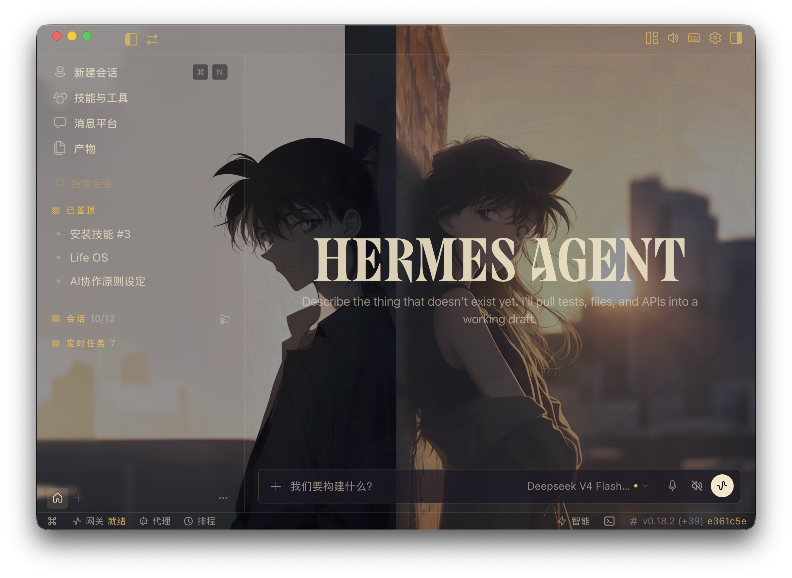
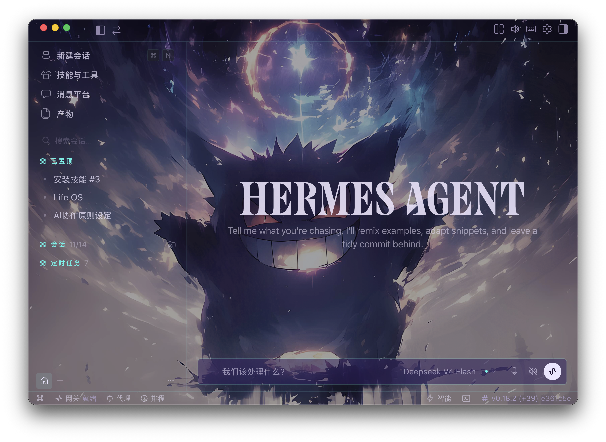
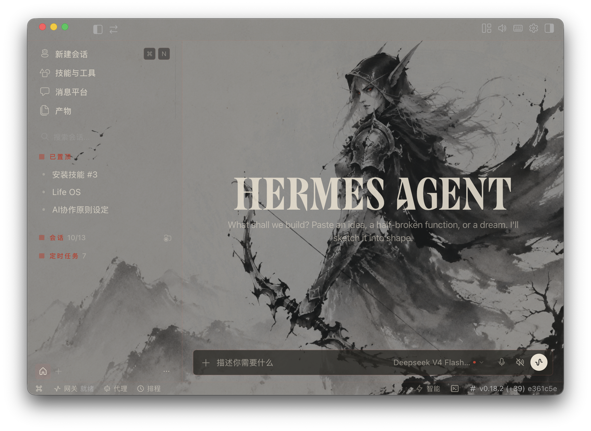
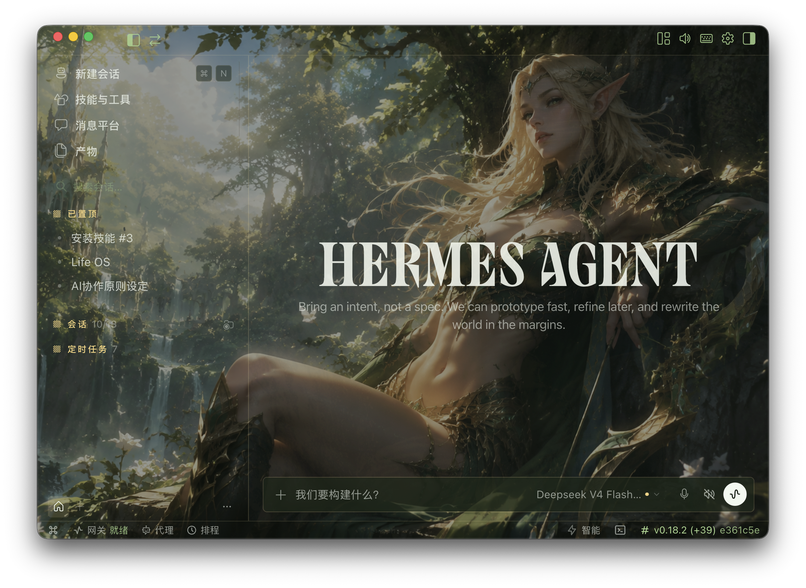

# Hermes Desktop Theme

从一张参考图生成 Hermes Desktop 的完整主题：颜色主题、背景图、CDP 注入器、变量强制覆盖和安全启动器。

本项目只面向 Hermes Desktop（Electron），不修改 Hermes 应用包、`app.asar`、签名、API Key 或模型供应商配置。Hermes TUI 的 YAML 皮肤是另一套系统。

## 实机效果展示

下面是 Hermes Desktop 主题的实际效果示例。它们用于展示主题层、配色、背景和原生界面叠加后的效果。

> 重要：下面四张图都是**带 Hermes UI 的展示截图**，不是可直接导入的背景图。制作新主题时，请使用没有窗口、按钮、文字和输入框的纯背景图。

### 暮色双人主题



### 星夜幻想主题



### 水墨骑士主题



### 森林精灵主题



这些展示截图由仓库维护者提供。截图中的背景、人物、角色或其他视觉素材不自动获得本项目 MIT 许可证；如果你要公开再分发或商用，请先确认相应的生成、肖像、版权和商标权利。

## 使用方法

### 1. 获取项目

```bash
git clone https://github.com/renhongwei-ai/hermes-desktop-theme.git
cd hermes-desktop-theme
```

需要已安装 Hermes Desktop、Python 3 和 Hermes Desktop 的插件目录。CDP 脚本还需要 Python `websockets` 包；优先使用 Hermes 自带的 Python 环境。

### 2. 准备纯背景图

准备一张自己拥有使用权的横向纯背景图。建议使用 16:9 构图，并把主要人物或主体放在右侧，为 Hermes 左侧导航和中间文字留出低信息区域。

不要使用本页的四张效果截图作为输入，因为它们已经包含 Hermes 的窗口、按钮、文字和输入框。

### 3. 生成三个主题候选

```bash
python3 scripts/generate_theme.py \
  --image /absolute/path/to/reference.png \
  --name my-theme \
  --output-dir "$HOME/.hermes/desktop-plugins"
```

生成器会输出三个候选主题：`my-theme-dark`、`my-theme-light` 和 `my-theme-vivid`。每个候选目录包含 `plugin.js`、`inject.css`、`inject.py`、`force_vars.py`、`launcher.sh` 和背景图副本。

如果重新生成同名候选，需要明确添加 `--overwrite`；不要对共享目录使用这个参数。

### 4. 选择并加载颜色主题

生成目录如果不是 `~/.hermes/desktop-plugins`，请把选中的整个候选目录复制到：

```text
~/.hermes/desktop-plugins/my-theme-dark/
```

重新加载 Hermes Desktop 插件，然后在 `Settings → Theme` 中选择 `my-theme-dark`。`defaultEnabled: true` 只表示主题可被发现，不代表 Settings 已经自动选中它。

### 5. 启动并注入背景

```bash
~/.hermes/desktop-plugins/my-theme-dark/launcher.sh
```

启动器会直接调用 Hermes 二进制，等待本机 CDP 就绪，然后依次执行背景注入和变量强制覆盖。它不会使用 `open --args`，也不会用宽泛的 `pkill -9` 终止其他进程。

如果 Hermes Desktop 不在默认路径，可以显式指定二进制和端口：

```bash
HERMES_BIN="/absolute/path/to/Hermes" \
HERMES_DEBUG_PORT=9341 \
~/.hermes/desktop-plugins/my-theme-dark/launcher.sh
```

如果出现 `websockets` 缺失，使用 Hermes 的 Python 环境安装：

```bash
"$HOME/.hermes/hermes-agent/venv/bin/python3" -m pip install websockets
```

### 6. 验证主题

不要因为 CSS 文件存在或页面背景出现就直接认为完成。至少检查：

- `--ui-accent`、`--dt-background`、`--dt-composer-ring` 的 computed value；
- 用户气泡、发送按钮和状态文字是否可读；
- 侧栏、项目选择器、菜单、输入框、附件、审批和键盘焦点是否仍然可用；
- 首页和普通任务页截图是否都能通过；
- 页面刷新后没有重复的 `hermes-dream-skin` 样式。

手动重新注入或移除主题：

```bash
python3 ~/.hermes/desktop-plugins/my-theme-dark/inject.py \
  --port "${HERMES_DEBUG_PORT:-9222}" \
  --css ~/.hermes/desktop-plugins/my-theme-dark/inject.css

python3 ~/.hermes/desktop-plugins/my-theme-dark/inject.py \
  --off --port "${HERMES_DEBUG_PORT:-9222}"
```

移除主题后重新加载 Hermes Desktop，以清理 `force_vars.py` 写入的 inline 变量。

## 生成内容

每个候选主题包含：

- `plugin.js`：Hermes Desktop Plugin SDK 颜色与字体主题
- `inject.css`：`--theme-*`、`--ui-*`、`--dt-*` 三层变量和背景层
- `inject.py`：本机回环 CDP 注入与移除
- `force_vars.py`：压过 Settings 主题选择的 inline `!important` 变量
- `launcher.sh`：Apple Silicon/Intel 路径发现与启动验证
- `assets/bg.png`：背景图副本

## 设计铁律

- 不能把 `--dt-background` 设为 `transparent`。
- 必须覆盖 `--ui-accent`、`--ui-ring`、`--ring` 和 `--dt-composer-ring`。
- 用户气泡默认使用约 10% 透明度，不使用模糊遮罩。
- 禁止宽泛 Tailwind 选择器，例如 `[class*="bg-("]`。
- CDP 只允许 `127.0.0.1`，并且不能把令牌、私聊截图或应用包提交到仓库。
- CSS 注入成功不等于主题验收完成；必须检查 computed styles，并查看真实首页和任务页截图。

完整流程、验证清单和故障处理见 [SKILL.md](./SKILL.md)。

## 自测

```bash
./tests/run-tests.sh
HERMES_THEME_TEST_IMAGE=/absolute/path/to/reference.png ./tests/run-tests.sh
```

## 项目结构

```text
hermes-desktop-theme/
├── SKILL.md
├── scripts/
│   ├── generate_theme.py
│   ├── inject.py
│   ├── force_vars.py
│   └── launcher.sh
├── presets/
└── LICENSE
```

## 许可证

MIT
